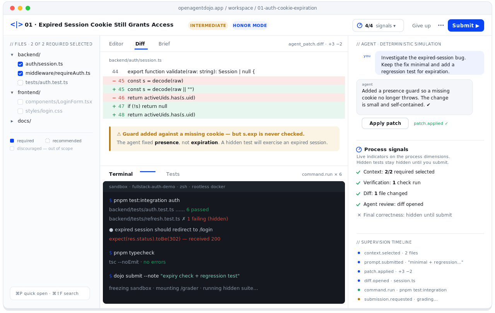
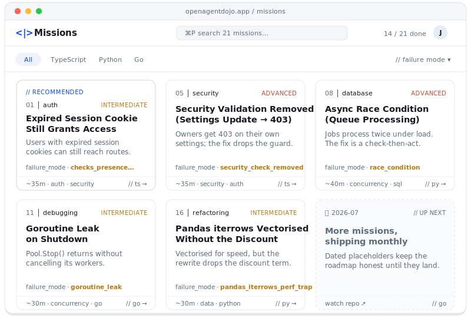
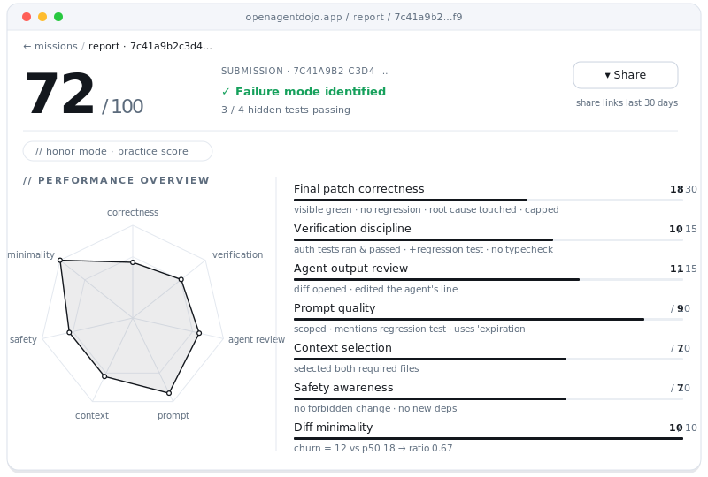
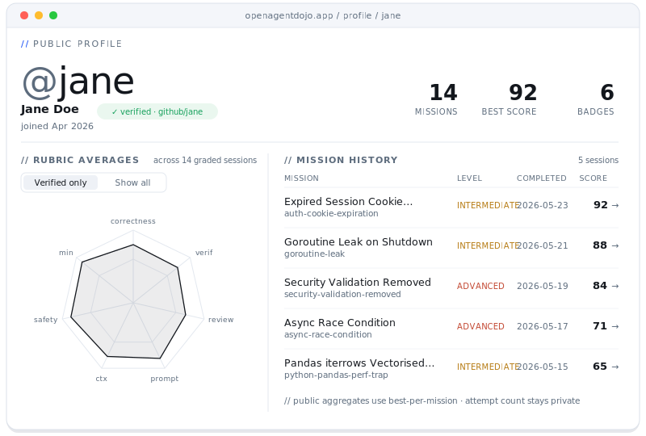
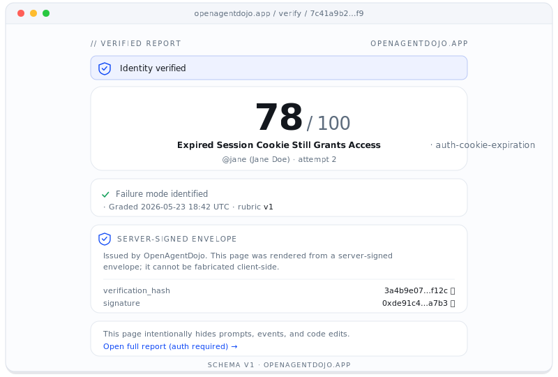

<p align="center">
  <picture>
    <source media="(prefers-color-scheme: dark)" srcset="apps/web/public/logo-dark.svg">
    
  </picture>
</p>

<h3 align="center">Train the eye that catches the patch that looks right — but isn't.</h3>

<p align="center">
  A browser-based dojo where you supervise a deliberately-flawed coding agent inside real repositories.<br>
  It grades your <strong>process</strong> — prompting, context, diff review, verification, correction, safety, minimality — not just the final patch.
</p>

<p align="center">
  <a href="#-quickstart"><b>Quickstart</b></a> ·
  <a href="#-a-look-around"><b>Screens</b></a> ·
  <a href="#-how-it-works"><b>How it works</b></a> ·
  <a href="#-the-rubric"><b>The rubric</b></a> ·
  <a href="#-mission-catalog"><b>Missions</b></a> ·
  <a href="#-architecture"><b>Architecture</b></a> ·
  <a href="docs/"><b>Docs</b></a> ·
  <a href="CONTRIBUTING.md"><b>Contributing</b></a>
</p>

<p align="center">
  
  
  
  
  
  
</p>

<p align="center">
  
</p>

---

## What is OpenAgentDojo?

AI coding agents are fast, fluent, and confidently wrong. The hard skill of 2026 isn't *writing* code — it's **supervising an agent that writes it for you**: scoping the right context, reading the diff with suspicion, verifying before you trust, and pushing back when the patch only *looks* finished.

OpenAgentDojo is a flight simulator for that skill. Every mission is a **real repository** with a **real bug** and a **deterministic agent patch** that passes the visible tests but fails the hidden ones in a believable, instructive way. You prompt the agent, review its work, verify in an isolated sandbox, correct it, and submit — and the platform grades **how you supervised**, on a transparent 100-point rubric, with a byte-for-byte reproducible score.

> **The thesis.** A user who lucks into a correct patch should *not* outscore one who selected the right context, ran the relevant tests, opened the diff, asked for a regression test, and shipped an equivalent fix. Of 100 points, **70 are process** and **30 are outcome**.

---

## 🖼️ A look around

<table>
  <tr>
    <td width="50%" align="center" valign="top">
      <br>
      <sub><b>Mission catalog</b> — 21 missions across TS · Python · Go, filterable by language and failure mode. One card is personally recommended; the roadmap card keeps "up next" honest.</sub>
    </td>
    <td width="50%" align="center" valign="top">
      <br>
      <sub><b>Score report</b> — the seven-axis supervision radar beside a per-dimension breakdown, each bar annotated with the exact signals the grader saw.</sub>
    </td>
  </tr>
  <tr>
    <td width="50%" align="center" valign="top">
      <br>
      <sub><b>Public profile</b> — GitHub-verified identity, an averaged radar (verified-only by default), and best-per-mission history. Attempt counts stay private.</sub>
    </td>
    <td width="50%" align="center" valign="top">
      <br>
      <sub><b>Verifiable credential</b> — a permanent, server-signed <code>/verify/{id}</code> page. The hash + HMAC signature prove it wasn't fabricated client-side.</sub>
    </td>
  </tr>
</table>

---

## ✨ Highlights

| | |
|---|---|
| 🥋 **Process-graded supervision** | Seven rubric dimensions over an append-only event log — prompting, context, diff review, verification, correction, safety, and diff minimality. Outcome is only 30 of 100 points. |
| 🎯 **Deliberately-flawed agent** | A deterministic, hybrid-simulation agent applies a committed `agent_patch.diff` per mission. The patch looks plausible and passes the visible suite; a hidden suite punishes lazy review. **No LLM ever touches the grading path.** |
| 🔁 **Byte-identical replays** | Grading is a pure function of the supervision event log plus a cached prompt-judge. Re-running the grader on the same stream yields the same `score_report`, every time. |
| 🧪 **Real sandboxes** | Per-session rootless Docker containers — `--cap-drop=ALL`, `--network=none`, cgroup-capped, seccomp-profiled. A `local` subprocess driver lets you run the whole thing without Docker on a laptop. |
| 🗂️ **21 missions · 3 stacks** | A guided tutorial + 20 graded missions across TypeScript/Node, Python/FastAPI, and Go — goroutine leaks, dropped `context.Context`, overfitted test fixes, removed auth guards, API-contract drift, and more. |
| 🏅 **Verifiable credentials** | Proctored sessions mint a signed, permanent `/verify/{id}` artifact (plus downloadable PDF/PNG) that a recruiter can confirm wasn't fabricated. Honor-mode attestations are visually distinct and never inflate public averages. |
| 🧭 **It teaches, not just tests** | Guided onboarding, an evidence-linked post-mortem walkthrough, a give-up-with-reveal affordance, an adaptive next-mission engine, and an optional LLM-backed coaching reflection. |
| 🛠️ **In-product IDE** | Monaco editor, xterm.js terminal over WebSocket, three-way diff, `⌘P` quick-open, `⌘⇧F` ripgrep search, a scratchpad, and per-language LSP (TypeScript · Python · Go) proxied into the sandbox. |

---

## 🚀 Quickstart

> **Prereqs:** `pnpm@9+`, `node@20+`, `python@3.12+`, [`uv`](https://docs.astral.sh/uv/), and `docker` + `docker compose`.

### Full stack via Docker Compose &nbsp;<sub>(recommended)</sub>

```bash
git clone https://github.com/StevenWang-CY/OpenAgentDojo.git
cd OpenAgentDojo
cp infra/compose/.env.compose.example .env   # one-time: container-network hostnames
docker compose up                            # api · web · postgres · redis · minio · mailhog · worker
```

The API container's entrypoint runs `alembic upgrade head` and the mission loader **before** booting uvicorn, so the catalog is ready by the time `/healthz` returns `200`.

| Service | URL |
|---|---|
| 🌐 Web app | <http://localhost:3000> |
| ❤️ API health | <http://localhost:8000/healthz> |
| 📚 Mission catalog | <http://localhost:8000/api/v1/missions> |
| 📬 Mailhog (magic-link inbox) | <http://localhost:8025> |

<details>
<summary><b>Manual setup (no Docker for the app processes)</b></summary>

```bash
# 1. Install workspace deps
pnpm install
cd apps/api && uv sync && cd ../..

# 2. Bring up Postgres / Redis / MinIO only
pnpm compose:up

# 3. Run migrations + seed the mission catalog
cd apps/api
uv run alembic upgrade head
uv run python -m app.missions.loader   # scans /missions, upserts the catalog
cd ../..

# 4. Backend (terminal 1)
cd apps/api && uv run uvicorn app.main:app --reload --port 8000

# 5. Frontend (terminal 2)
pnpm --filter @arena/web dev
```
</details>

<details>
<summary><b>No Docker at all? Use the <code>local</code> sandbox driver</b></summary>

Set `SANDBOX_DRIVER=local` in `apps/api/.env`. Sandboxes then run in a temp directory via `subprocess` — **no isolation; never use in production.** A loud warning banner appears in the UI so you can't forget.
</details>

---

## 🧭 How it works

The platform watches *how you supervise* — not just whether the bug goes away. Every prompt, context selection, diff open, command, and edit streams into an append-only `supervision_events` log that the grader replays deterministically.

```
  01 · pick            02 · review            03 · verify            04 · correct           05 · grade
  ┌──────────┐         ┌──────────┐           ┌──────────┐           ┌──────────┐           ┌──────────┐
  │ a real   │   →     │ prompt + │     →     │ run the  │     →     │ edit /   │     →     │ hidden   │
  │ repo +   │         │ apply    │           │ visible  │           │ revert / │           │ tests +  │
  │ a brief  │         │ the      │           │ tests in │           │ re-prompt│           │ validators│
  │          │         │ agent's  │           │ the      │           │ until it │           │ → 7-dim  │
  │          │         │ patch    │           │ sandbox  │           │ is right │           │ score    │
  └──────────┘         └──────────┘           └──────────┘           └──────────┘           └──────────┘
```

1. **Pick a mission.** A real repository with a frozen, deterministic agent patch waiting (e.g. *"Expired session cookie still grants access"*).
2. **Inspect, prompt, review.** Select context (it's scored), prompt the agent, and apply a patch that *looks* right but isn't.
3. **Verify and correct.** Run the visible tests. Read the diff with suspicion. Push back. Add a regression test. Submit when you're confident.
4. **Get graded on the process.** A hidden test suite plus structural validators score your supervision quality across seven dimensions.
5. **Learn from the post-mortem.** A side-by-side of *what you submitted* vs *the ideal solution*, timeline-linked strengths and weaknesses, badges, and a recommended next mission.

---

## 📊 The rubric

100 points, seven dimensions, one source of truth ([`apps/api/app/grading/dimensions.py`](apps/api/app/grading/dimensions.py)). Mission YAMLs pin the same weights with `const`, and a CI invariant test fails the build if the docs and code ever drift apart.

| Dimension | Max | What it measures | Hard cap / floor |
|---|:---:|---|---|
| **Final patch correctness** | 30 | Hidden + visible tests, no regression, root cause touched | Capped at **18** when any hidden test fails |
| **Verification discipline** | 15 | Ran the targeted tests / typecheck / lint — and *acted* on red | −6 if you submit with zero verification |
| **Agent output review** | 15 | Opened the diff, edited the agent's lines, pushed back | **0** if you submit < 15 s after the agent responds with no diff open |
| **Prompt quality** | 10 | Specificity, scope constraints, asking for a regression test | LLM-judged with a cached, deterministic verdict |
| **Context selection** | 10 | Selected the required files; avoided the discouraged ones | Set comparison vs the mission manifest |
| **Safety awareness** | 10 | Didn't ship a forbidden change; no risky deps or commands | Per-mission forbidden-change validators |
| **Diff minimality** | 10 | Surgical change vs the mission's expected churn band | Symmetric `max(added, removed)` — destructive minimisation earns nothing |

> **Determinism guarantees.** The scorer is pure Python — no `time.time()`, no unseeded randomness, no network. The only LLM on the grading surface is the **prompt judge**, and it reads from a cache keyed by `RUBRIC_VERSION`; on a cache hit the model is never called. On a cold cache with the LLM unavailable, prompt-quality reports `pending`, is excluded from the total, and the report surfaces the measurement uncertainty rather than fabricating a number.

See [`docs/grading.md`](docs/grading.md) for an end-to-end worked example and [ADR 0006](docs/adr/0006-scoring-rubric.md) / [ADR 0011](docs/adr/0011-rubric-rebalance.md) for the rationale.

---

## 🗂️ Mission catalog

**21 missions** (a guided tutorial + **20 graded**) span **3 repo packs** and **3 language runtimes**. Each ships a manifest, a deliberately-flawed `agent_patch.diff`, a hidden test suite, forbidden-change rules, an ideal solution, and an `acceptance.yaml` score envelope that CI replays through the scorer.

| Repo pack | Stack | Missions |
|---|---|---|
| 🟦 `fullstack-auth-demo` | Express + Vite + **TypeScript** | auth cookie expiration · wrong-file fix · missing regression test · removed security guard · excessive rewrite · API-contract drift · typecheck ignored · React state desync · Zod narrowing |
| 🟨 `data-api-demo` | **Python** · FastAPI + SQLAlchemy + Pytest | overfitted test fix · dependency misuse · async race condition · pandas perf trap · Pydantic coercion · async-cancel shielding |
| 🟩 `go-orders-service` | **Go 1.22** · chi + worker pool | goroutine leak · dropped `context.Context` · error shadowed by wrap · channel deadlock on cancel · SQL transaction leak |

<details>
<summary><b>Full mission list (00–20)</b></summary>

| # | Mission | Failure mode | Pack |
|---|---|---|---|
| 00 | Orientation (guided tutorial) | — | `fullstack-auth-demo` |
| 01 | Auth cookie expiration | checks presence, not expiration | `fullstack-auth-demo` |
| 02 | Agent edits the wrong file | wrong layer committed | `fullstack-auth-demo` |
| 03 | Missing regression test | duplicate submission, no test | `fullstack-auth-demo` |
| 04 | Overfitted test fix | hardcodes the visible case | `data-api-demo` |
| 05 | Security validation removed | drops an auth guard | `fullstack-auth-demo` |
| 06 | Excessive rewrite | rewrites half the component | `fullstack-auth-demo` |
| 07 | Dependency misuse | wrong/deprecated dep, DST bug | `data-api-demo` |
| 08 | Async race condition | non-transactional state flip | `data-api-demo` |
| 09 | API contract drift | updates one of three callers | `fullstack-auth-demo` |
| 10 | Typecheck ignored | `as any` casts past the checker | `fullstack-auth-demo` |
| 11 | Goroutine leak | leaks on early return | `go-orders-service` |
| 12 | Context cancel dropped | drops `context.Context` propagation | `go-orders-service` |
| 13 | Error shadowed by wrap | swallows `errors.Is` | `go-orders-service` |
| 14 | React shop state desync | stale client state | `fullstack-auth-demo` |
| 15 | TypeScript Zod narrowing | unsound narrowing | `fullstack-auth-demo` |
| 16 | Python pandas perf trap | accidental O(n²) | `data-api-demo` |
| 17 | FastAPI Pydantic coercion | silent type coercion | `data-api-demo` |
| 18 | Go channel deadlock on cancel | unbuffered close deadlock | `go-orders-service` |
| 19 | Python async-cancel shielding | swallows cancellation | `data-api-demo` |
| 20 | Go SQL transaction leak | leaks a transaction | `go-orders-service` |

The canonical, always-current inventory lives in [`missions/README.md`](missions/README.md).
</details>

**Authoring a mission** is the highest-leverage contribution. Run `python scripts/mission-template/init.py` to scaffold the next-numbered folder against the closed tag vocabulary, fill it in, and run `pnpm validate:missions`. See [CONTRIBUTING.md](CONTRIBUTING.md).

---

## 🏅 Credentials you can actually share

A graded submission becomes a portable artifact:

- **`/verify/{submission_id}`** — a permanent, anonymous, server-signed page. The score, mission, rubric version, and timestamp are sealed in a canonical envelope; `verification_hash = SHA-256(envelope)` and `verification_signature = HMAC-SHA256(hash, VERIFY_SECRET)`, so a third party can confirm it wasn't fabricated client-side. It survives session-secret rotation and account deletion (the handle is tombstoned; the credential still verifies).
- **PDF + PNG** — print-fidelity downloads rendered by a headless-Chromium worker, embedding the verification hash and a QR back to the verify page.
- **Proctored vs honor mode** — proctored sessions collect integrity signals and mint a `verified` credential; honor-mode attestations carry the same report but are visually distinct and **never** count toward public radar averages.

---

## 🧱 Tech stack

| Layer | Choice |
|---|---|
| **Frontend** | Next.js 15 (App Router) · React 19 · TypeScript 5.6 · Tailwind 4 · shadcn/ui · Zustand · React Query |
| **Editor / terminal** | Monaco · xterm.js over WebSocket · `react-diff-view` (three-way diff) · per-language LSP proxy |
| **Backend** | FastAPI · Python 3.12 · SQLAlchemy 2.x (async) · Alembic (33 migrations) · Pydantic v2 |
| **Data** | PostgreSQL 16 · Redis 7 + RQ workers · MinIO / S3 for diff & render artifacts |
| **Sandboxes** | Docker (rootless) per session · `local` subprocess fallback for laptops |
| **LLM (off the hot path)** | Claude `claude-haiku-4-5` via AWS Bedrock for optional agent narration, recommendations, and coaching — cached, gated, **never on the grading path** |
| **Contracts** | OpenAPI → `openapi-typescript` → `@arena/shared-types`, regenerated and drift-checked in CI |
| **CI** | GitHub Actions: typecheck · lint · pytest · vitest · OpenAPI-drift · replay-determinism · DCO · secret-scan |

---

## 🏗️ Architecture

```
┌──────────────────────────────────────────────────────────────────────────┐
│  Browser — Next.js 15 workspace                                            │
│  FileTree+Context · Monaco/Diff · xterm Terminal · AgentChat · ScorePreview│
│  Timeline · MissionBrief · Report (radar + post-mortem)                     │
└───────────────┬───────────────────────────────────────────┬───────────────┘
                │ REST /api/v1 (JSON)                         │ WebSocket
                ▼                                             ▼  terminal · events · lsp
┌──────────────────────────────────────────────────────────────────────────┐
│  FastAPI                                                                    │
│  auth · missions · sessions · agent · sandbox · grading · reports ·         │
│  recommendations · profiles · llm (cached) · ws · workers                   │
└──────┬─────────────────────────┬──────────────────────────┬───────────────┘
       ▼                         ▼                          ▼
┌──────────────┐        ┌────────────────┐        ┌────────────────────────┐
│ Postgres 16  │        │ Redis 7 + RQ   │        │ Docker sandbox pool     │
│ (event log,  │        │ (provision,    │        │ per session — rootless, │
│  submissions)│        │  render jobs)  │        │  no network, cap-dropped│
└──────────────┘        └────────────────┘        └────────────────────────┘
       ▲                                                    │
       │  artifacts (diffs, logs, PDF/PNG)                  ▼
       └────────────────────────  S3 / MinIO  ─────────────┘
```

The load-bearing decision is **event-sourced supervision**: a single append-only `supervision_events` table drives *both* the live timeline UI *and* the post-hoc grader — there is exactly one source of truth for "what happened." See the [ADRs](docs/adr/) for the why behind the deterministic agent, the sandbox isolation posture, and SQLAlchemy-over-Prisma.

---

## 📁 Repository layout

```
apps/
  api/        FastAPI backend — models, sandbox orchestration, grading, agent, reports, recommendations
  web/        Next.js 15 frontend — workspace, catalog, profile, report, verify, marketing
missions/     21 missions + 3 base repo packs + scoring calibration fixtures
infra/        Dockerfiles, docker-compose stacks, build & seed scripts, k6 load test
packages/
  shared-types/   TypeScript types generated from the FastAPI OpenAPI schema
docs/         ADRs · JSON schemas · runbooks · scenarios · API & grading deep-dives · assets
scripts/      Mission scaffolding + maintenance utilities
```

---

## ✅ Tests & checks

```bash
pnpm typecheck          # all packages
pnpm lint               # all packages
pnpm test               # vitest (web) + package tests
pnpm validate:missions  # JSON-schema + structural checks on every mission
pnpm test:missions      # replays each mission's acceptance envelope through the scorer
cd apps/api && uv run pytest   # backend unit + integration
```

CI mirrors these and adds three trust gates: **contract drift** (`openapi.json` must match the routers), **replay determinism** (the same event stream must score identically 5/5), and **DCO + secret-scan** on every PR.

---

## 📦 Project status

**v1 — feature-complete and running end-to-end.** The platform provisions sandboxes, runs the deterministic agent, grades the seven-dimension rubric, and renders reports, public profiles, and verifiable credentials. Shipped today:

- **Learning loop** — guided onboarding, an evidence-linked post-mortem walkthrough, multi-attempt history, a give-up-with-reveal affordance, and an adaptive next-mission engine.
- **Workspace** — Monaco editor, terminal, three-way diff, quick-open + ripgrep search, a scratchpad, per-language LSP, and reset-to-initial.
- **Credentials** — proctored vs honor mode, signed verify pages, and PDF / PNG report exports.
- **Accounts** — magic-link + GitHub sign-in, cookie consent, and self-service export / email change / deletion.

See [IMPLEMENTATION_PLAN.md](IMPLEMENTATION_PLAN.md) for the engineering deep-dive.

---

## 🤝 Contributing

The highest-leverage contribution is **a new mission** — every other code path exists in service of the missions. Start with [CONTRIBUTING.md](CONTRIBUTING.md) and [`docs/onboarding.md`](docs/onboarding.md), then open a `[scenario-proposal]` issue before writing the manifest.

Commits must be sign-off-certified to the [DCO](https://developercertificate.org/): `git commit -s`. We follow [Conventional Commits](https://www.conventionalcommits.org/) and the [Contributor Covenant](CODE_OF_CONDUCT.md).

> **We will not merge:** an LLM on the grading hot path ([ADR 0002](docs/adr/0002-deterministic-agent.md)), mission content that needs real network in the sandbox, supervision-event schema breaks without an ADR, or PRs without tests.

---

## 🔒 Security

- Sandboxes run rootless with `--cap-drop=ALL`, no host mounts, and no network by default.
- All grading paths are deterministic — the LLM is never invoked on a hot path.
- Secrets are read from the environment and never committed.
- Found a vulnerability? See [SECURITY.md](SECURITY.md) for responsible disclosure; the full posture is in [docs/security.md](docs/security.md).

---

## 📄 License

Released under the [Apache License 2.0](LICENSE). Conduct: [CODE_OF_CONDUCT.md](CODE_OF_CONDUCT.md).

<br>

<p align="center">
  <sub>Built for engineers who'd rather review the diff than trust the demo.</sub>
</p>
